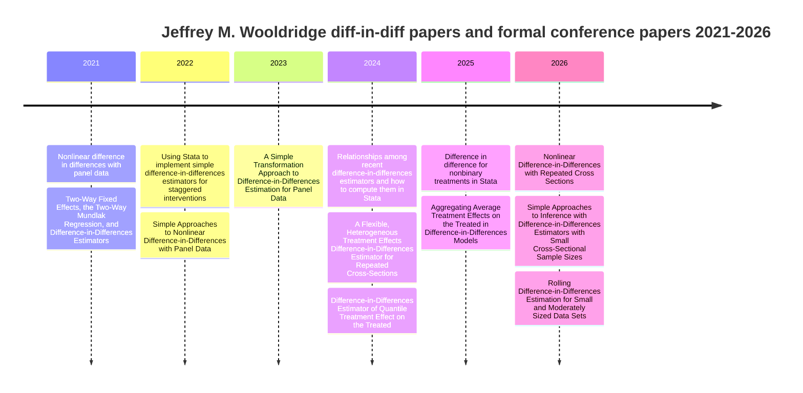

# Jeffrey M. Wooldridge on Difference-in-Differences from 2021 through 2026

## Executive summary

I identified **13 qualifying items** from 2021 through 2026 that are authored or coauthored by Jeffrey M. Wooldridge and whose main subject is difference-in-differences: **2 journal articles, 3 NBER/SSRN-style working papers, 5 formal conference papers/proceedings records, 2 additional 2026 preprints/working papers, and 1 AEA conference preview paper**. I found **no qualifying book chapters** in this window. The research arc is clear: Wooldridge first reframed modern staggered-adoption DiD through the two-way Mundlak/extended two-way fixed-effects equivalence, then extended DiD to nonlinear outcomes, repeated cross-sections, nonbinary treatments, and small-cross-section inference, while coauthors extended the framework to rolling transformations and aggregation of cohort-time effects. Every year from 2021 through 2026 has at least one qualifying item. citeturn37view0turn4view0turn25view0turn20view0turn32view0turn32view1turn17view0turn30search1turn31search0

The highest-confidence backbone of this corpus comes from official records at entity["organization","SSRN","elsevier research network"], entity["organization","National Bureau of Economic Research","cambridge, ma, us"], entity["organization","IDEAS/RePEc","economics bibliography"], journal publisher pages, the entity["organization","American Economic Association","economics association"] program, and Jeffrey M. Wooldridge’s June 2024 CV from entity["organization","Michigan State University","east lansing, mi, us"]. A few 2026 metadata points remain slightly messy, especially one SSRN identifier conflict for the small-sample-inference paper; I flag that explicitly below instead of smoothing it over. citeturn3search0turn25view0turn32view0turn32view1turn17view0turn13view0turn30search1turn30search7

The timeline below uses the **first public appearance** I could verify for each substantive item. Published-journal versions are recorded in the table and version notes. citeturn15view1turn25view0turn16view0turn20view0turn26view0turn41view3turn32view0turn42search5turn41view1turn32view1turn17view0turn30search1turn31search0

## Scope and inclusion rules

I included an item when all of the following were true: Jeffrey M. Wooldridge was an author or coauthor; the item was publicly posted, published, or listed as a formal conference paper during 2021 through 2026; and the **primary topic or a substantial share of the content** was DiD methodology or a DiD application. I prioritized official records from Wooldridge’s CV, author pages, journal pages, NBER, SSRN, and IDEAS/RePEc. I excluded software components from the main table because the brief asked for papers, chapters, preprints, and conference papers; I still note directly related code or software where I found it. citeturn3search0turn37view0turn25view0turn32view0turn32view1turn17view0turn42search2turn42search4turn42search9

One judgment call matters. Several Stata conference records are not merely talks in a loose sense; they are formal conference-paper records indexed by RePEc/IDEAS with stable handles, abstracts, and often downloadable PDFs. I therefore include them. By contrast, I did **not** promote informal workshop pages or videos into the main corpus unless they had a formal conference-paper or preview-paper record. citeturn15view0turn16view0turn38view1turn38view0turn17view0

## Chronological table

| Year | Citation | Type | Link | PDF | Summary | Versions and notes |
|---|---|---|---|---|---|---|
| 2021 | Wooldridge, Jeffrey M. “Nonlinear difference in differences with panel data.” *Economics Virtual Symposium 2021*, paper 4, entity["organization","Stata Users Group","stata conferences"]. | Conference paper | IDEAS/RePEc handle RePEc:boc:econ21:4. citeturn15view0turn15view1 | Zip of presentation materials linked from IDEAS/RePEc. citeturn15view0 | Earliest formal conference record in this window for Wooldridge’s nonlinear DiD program; it is the visible precursor to the 2022 SSRN preprint and 2023 journal article on nonlinear DiD with panel data. citeturn15view0turn20view0turn23search1 | Official record has **no abstract**. Series page dates the symposium to **10 Nov. 2021**. Materials are distributed as a zip, not a standalone PDF. citeturn15view0turn15view1 |
| 2021 | Wooldridge, Jeffrey M. “Two-Way Fixed Effects, the Two-Way Mundlak Regression, and Difference-in-Differences Estimators.” Later published as *Empirical Economics* 69(5): 2545-2587 (2025). | Working paper → published article | SSRN DOI **10.2139/ssrn.3906345**; published-version DOI **10.1007/s00181-025-02807-z**. citeturn25view0turn25view2turn25view1 | SSRN paper page / PDF access via SSRN; Springer record for article. citeturn25view0turn25view2 | This is the foundational Wooldridge DiD paper of the period. It shows the equivalence of TWFE and the two-way Mundlak regression, reframes staggered-adoption DiD as flexible pooled OLS with appropriate interactions, and links TWFE, ETWFE, imputation, event-study, and nonlinear extensions. citeturn25view0turn25view2 | Posted **18 Aug. 2021** on SSRN; article version appears in **Nov. 2025**. No official replication package was located on the official publication pages I checked. Community implementations include `wooldid` and `etwfe`, but those are not author-issued replication archives. citeturn25view0turn25view2turn42search10turn22search6 |
| 2022 | Wooldridge, Jeffrey. “Using Stata to implement simple difference-in-differences estimators for staggered interventions.” *French Stata Users’ Group Meetings 2022*, paper 27. | Conference paper | IDEAS/RePEc handle RePEc:boc:fsug22:27. citeturn16view0 | No downloadable PDF was listed on the IDEAS/RePEc record I found. citeturn16view0 | This paper translates Wooldridge’s staggered-adoption DiD framework into implementable Stata workflows using pooled OLS, doubly robust estimators, and matching, while emphasizing heterogeneous effects and diagnostics for parallel-trends failures. citeturn16view0 | Official record is dated **2022**; Wooldridge’s CV places the French Stata keynote in **June 2022**. citeturn16view0turn5view0 |
| 2022 | Wooldridge, Jeffrey M. “Simple Approaches to Nonlinear Difference-in-Differences with Panel Data.” Later published in *The Econometrics Journal* 26(3): C31-C66 (2023). | Preprint → published article | SSRN DOI **10.2139/ssrn.4183726** for the Jan. 2022 preprint; article DOI **10.1093/ectj/utad016**. citeturn23search1turn20view0turn22search2 | Open-access publisher PDF available. citeturn22search0 | Wooldridge extends modern staggered DiD to nonlinear conditional-mean models such as logit, fractional logit, and Poisson with covariates. The paper argues that pooled QMLE in linear-exponential-family models can recover cohort-time ATTs cleanly and often very simply. citeturn20view0 | Preprint first visible in **Jan. 2022**; article published online **24 Aug. 2023** and corrected/typeset **19 Sept. 2023**. The 2021 Stata symposium paper is the formal conference precursor. citeturn23search1turn20view0turn15view0 |
| 2023 | entity["people","Soo Jeong Lee","economist"] and Jeffrey M. Wooldridge. “A Simple Transformation Approach to Difference-in-Differences Estimation for Panel Data.” | Working paper / preprint | SSRN DOI **10.2139/ssrn.4516518**. citeturn26view0 | SSRN paper page / PDF. Early PDF version posted from a Queen’s-hosted seminar paper archive is also discoverable. citeturn26view0turn31search23 | The paper proposes a unit-level “rolling” or averaging transformation that turns panel DiD with staggered adoption into a series of cross-sectional treatment-effect problems. It emphasizes compatibility with many estimators, especially doubly robust estimators, and shows how unit-specific trends can be incorporated. citeturn26view0 | Posted **27 Jul. 2023**; last revised **25 Dec. 2025**. The early July 2023 PDF lists both authors at Michigan State; the revised SSRN page lists Lee at entity["organization","Southern Illinois University Carbondale","carbondale, il, us"] and Wooldridge at Michigan State. citeturn26view0turn31search23 |
| 2024 | Wooldridge, Jeffrey. “Relationships among recent difference-in-differences estimators and how to compute them in Stata.” *UK Stata Conference 2024*, paper 24. | Conference paper | IDEAS/RePEc handle RePEc:boc:lsug24:24. citeturn38view1 | Official conference PDF link is listed on the IDEAS/RePEc record. citeturn38view1 | This conference paper is an integrative map of the recent staggered-adoption DiD literature, focused on how competing estimators relate and how to compute them in Stata. It is less a new estimator than a synthesis and implementation guide. citeturn38view1 | Serial page dates the conference to **12-13 Sept. 2024**. citeturn41view2turn41view3 |
| 2024 | entity["people","Partha Deb","economist"], entity["people","Edward C. Norton","health economist"], Jeffrey M. Wooldridge, and entity["people","Jeffrey E. Zabel","economist"]. “A Flexible, Heterogeneous Treatment Effects Difference-in-Differences Estimator for Repeated Cross-Sections.” NBER Working Paper 33026. | Working paper | NBER DOI **10.3386/w33026**. RePEc handle RePEc:nbr:nberwo:33026. citeturn32view0turn11view3 | NBER PDF available. citeturn10search1turn33view0 | This paper extends Wooldridge-style flexible regression DiD to repeated cross-sections with staggered timing and heterogeneous treatment effects. It proposes the FLEX estimator, proves equivalence with an imputation estimator under the stated conditions, and emphasizes transparent aggregation and standard errors. citeturn32view0turn33view0 | Issued **Oct. 2024**; revised **May 2025**. The first-page PDF lists affiliations as entity["organization","Hunter College","new york, ny, us"] and NBER, entity["organization","University of Michigan","ann arbor, mi, us"] and NBER, Michigan State, and entity["organization","Tufts University","medford, ma, us"]. Related code: `flexdid`, a Stata module tied directly to this FLEX framework. citeturn33view0turn42search4turn42search8 |
| 2024 | entity["people","Doosoo Kim","economist"] and Jeffrey M. Wooldridge. “Difference-in-Differences Estimator of Quantile Treatment Effect on the Treated.” *Journal of Business & Economic Statistics* 43(2): 401-412 (2025). | Published article | DOI **10.1080/07350015.2024.2388643**. citeturn18view1 | Publisher-linked article data/metadata record available; access to the journal PDF itself is subscription-limited on the IDEAS record. citeturn18view1turn42search5 | This paper develops a DiD estimator for the **quantile treatment effect on the treated** under a distributional DiD restriction that remains compatible with the usual mean DiD framework. It proves consistency and weak convergence, allows covariates, and illustrates the method with an EITC-birth-weight application. citeturn18view1turn42search13 | The article appears in the **Apr. 2025** issue, but publisher-linked records show the paper circulating online in **Aug. 2024**. Affiliations in the sources I found are Toronto Metropolitan University for Kim and Michigan State for Wooldridge. Related code: Doosoo Kim hosts a Stata ado file; a Taylor & Francis Figshare record is also available. citeturn18view1turn19search0turn19search2turn42search5turn42search9 |
| 2025 | Wooldridge, Jeffrey. “Difference in difference for nonbinary treatments in Stata.” *2025 Stata Conference*, paper 14. | Conference paper | IDEAS/RePEc handle RePEc:boc:usug25:14. citeturn38view0 | Official conference PDF link is listed on the IDEAS/RePEc record. citeturn38view0 | This paper extends Wooldridge’s ETWFE-style regression framework to interventions with more than two treatment levels, including continuous and multi-level discrete treatments. It also keeps the familiar DiD toolkit of aggregation, pretrend testing, and heterogeneous trends. citeturn38view0 | Serial page dates the conference to **31 Jul.-1 Aug. 2025** in Nashville. The abstract’s empirical illustration is Walmart openings and retail employment at the county level. citeturn38view0turn41view0turn41view1 |
| 2025 | Deb, Norton, Wooldridge, and Zabel. “Aggregating Average Treatment Effects on the Treated in Difference-in-Differences Models.” NBER Working Paper 34331. | Working paper | NBER DOI **10.3386/w34331**; SSRN record **5568722**. citeturn32view1turn35search3 | NBER PDF available. citeturn35search0 | This paper shifts attention from identification to **aggregation weights**: once cohort-time treatment effects are consistently estimated, how should they be aggregated into an overall ATT? The paper shows that common software weights are not simply “number treated in treated years” weights and explains when the distinction matters empirically. citeturn32view1 | NBER issue date **Oct. 2025**; SSRN page says **posted 7 Oct. 2025** and **revised 22 Oct. 2025**. It is conceptually a sequel to the repeated-cross-sections FLEX paper. citeturn32view1turn35search3 |
| 2026 | Wooldridge, Jeffrey M. “Nonlinear Difference-in-Differences with Repeated Cross Sections.” preview paper for the AEA session “Recent Advances in Difference-in-Differences.” | Conference paper / preview paper | Official AEA program record and preview-paper page. citeturn17view0turn39view0 | Official AEA preview PDF available. citeturn17view0turn39view0 | This paper extends Wooldridge’s 2023 nonlinear panel-data DiD methods to repeated cross-sections, covering logit, fractional logit, and Poisson models under a conditional-parallel-trends formulation. It also provides a unified treatment of “lags only” and “leads and lags” estimators and links the nonlinear repeated-cross-section setting back to the linear DNWZ/FLEX framework. citeturn17view0turn39view0 | The AEA program dates the session to **4 Jan. 2026** in Philadelphia. This is a new 2026 item, not just a repost of the 2024 NBER repeated-cross-sections paper. citeturn17view0turn39view0 |
| 2026 | Lee and Wooldridge. “Simple Approaches to Inference with Difference-in-Differences Estimators with Small Cross-Sectional Sample Sizes.” | Working paper / preprint | SSRN page is indexed under abstract_id **6269677** in one search result; related package documentation cites SSRN **5325686**. citeturn30search1turn30search7turn29search0 | PDF search results exist; direct open from SSRN was inconsistent. citeturn27search0turn30search6 | The paper tackles a live applied problem: valid DiD inference when there are very few treated or control units. It collapses the panel to a cross section via transformation, shows when exact inference is available, discusses randomization inference, and allows unit-specific trends and controls in larger samples. citeturn27search0turn29search2 | This is the one metadata conflict in the corpus. SSRN search results suggest a page posted **19 Feb. 2026**, while ResearchGate lists **Jan. 2026** and package documentation cites a different SSRN number. I would treat the paper as definitely real and public by early 2026, but the exact SSRN identifier should be verified from SSRN itself before formal bibliography cleanup. citeturn27search2turn29search2turn30search7turn30search6 |
| 2026 | Lee and Wooldridge. “Rolling Difference-in-Differences Estimation for Small and Moderately Sized Data Sets.” | Working paper / preprint | SSRN page indexed at abstract_id **6502558**. citeturn31search0turn42search14 | PDF search result exists. citeturn31search1 | This paper operationalizes the rolling-transformation DiD idea for both large and small panels and is tightly connected to the `lwdid` software. It turns the transformed DiD problem into a practical sequence of cross-sectional estimators suitable for staggered adoption and common-timing cases. citeturn31search0turn31search3 | Search results show **posted 31 Mar. 2026**; one SSRN snippet reports **Date Written: 3 Apr. 2026**, a minor metadata mismatch. Directly related code: `lwdid` Stata module and the companion Python package/docs. citeturn31search1turn11search4turn42search2turn31search18 |

## Annotated records

**Nonlinear difference in differences with panel data.** The official IDEAS/RePEc conference-paper record lists Jeffrey M. Wooldridge of Michigan State University as the sole author and provides a stable series handle plus a downloadable zip of presentation materials, but **no abstract**. Because the later 2022 SSRN / 2023 journal item is clearly the expanded version of the same research line, this 2021 symposium paper should be read as the first formal conference appearance of Wooldridge’s nonlinear DiD framework. citeturn15view0turn15view1turn20view0

**Two-Way Fixed Effects, the Two-Way Mundlak Regression, and Difference-in-Differences Estimators.** The SSRN page identifies Wooldridge as sole author, lists the posting date as 18 August 2021, and gives the Michigan State University Department of Economics affiliation. The later *Empirical Economics* version keeps the paper’s core contribution intact: TWFE, TWM, and ETWFE are shown to be algebraically linked in ways that clarify modern staggered DiD practice, including how to model heterogeneity, event-study effects, and nonlinear extensions. I did not locate an official replication archive on the publication pages searched. citeturn25view0turn25view2turn25view1

**Using Stata to implement simple difference-in-differences estimators for staggered interventions.** This 2022 French Stata conference paper is a straight implementation piece. Its official abstract states that built-in Stata commands can be used to estimate heterogeneity-robust staggered DiD via regression, doubly robust methods, and matching, and that the framework supports testing and correcting failures of parallel trends. The IDEAS record did not expose a direct downloadable file when I checked, so I treat it as a genuine conference-paper record with incomplete file availability. citeturn16view0turn5view0

**Simple Approaches to Nonlinear Difference-in-Differences with Panel Data.** The journal article is open access and much richer than the 2021 conference precursor. Its official publisher page gives the publication timeline, Michigan State affiliation, and an article summary showing the core logic: impose parallel trends on an index of the conditional mean, then recover cohort-time ATTs in nonlinear models through pooled QMLE and average partial effects. For applied researchers using binary, fractional, or count outcomes, this is one of Wooldridge’s most practically important DiD papers in the period. citeturn20view0turn22search0turn22search2

**A Simple Transformation Approach to Difference-in-Differences Estimation for Panel Data.** The SSRN record shows a 2023 posting and a 2025 revision, with coauthorship by Lee and Wooldridge. The paper’s abstract is unusually clear: transform outcomes using pre-treatment averages, carefully select controls period by period, and then apply familiar treatment-effect estimators, including doubly robust ones. The July 2023 PDF shows both authors at Michigan State University, while the revised SSRN page shows Lee at Southern Illinois University Carbondale; that is a normal affiliation drift across versions, not a bibliographic conflict. citeturn26view0turn31search23

**Relationships among recent difference-in-differences estimators and how to compute them in Stata.** This 2024 UK Stata conference paper is a synthesis piece rather than a paper with a new theorem. Its value is practical and interpretive: it compares popular modern DiD estimators for panel staggered-adoption settings and shows how to compute and interpret them in Stata. For lawyers, consultants, and policy analysts trying to choose among estimators in real work, that sort of synthesis matters more than it sounds. citeturn38view1turn41view2turn41view3

**A Flexible, Heterogeneous Treatment Effects Difference-in-Differences Estimator for Repeated Cross-Sections.** This is one of the most important coauthored Wooldridge DiD papers in the period because it tackles repeated cross-sections, which are everywhere in public-policy data. The first-page PDF gives the affiliations explicitly: Hunter College/NBER, University of Michigan/NBER, Michigan State, and Tufts. The paper also has the cleanest author-linked software tie-in I found: `flexdid` is explicitly described as implementing the FLEX framework in Stata. citeturn32view0turn33view0turn42search4turn42search8

**Difference-in-Differences Estimator of Quantile Treatment Effect on the Treated.** This article pushes Wooldridge’s DiD program beyond mean effects into distributional treatment effects. The official abstract says the identifying assumption is a common time effect on the CDF of untreated potential outcomes, allowing covariates and remaining compatible with usual mean DiD logic. It also has unusually good practical extras: a Stata ado file is hosted on Doosoo Kim’s site, and a Taylor & Francis Figshare record exists for the article materials. citeturn18view1turn42search5turn42search9turn19search6

**Difference in difference for nonbinary treatments in Stata.** This 2025 Stata conference paper is not just a narrow software note. The abstract shows that Wooldridge is generalizing ETWFE-style DiD to continuous or multi-level treatments while preserving standard regression-based aggregation, inference, pretrend checks, and heterogeneous trends. That matters because modern DiD debates increasingly involve intensity or dose rather than a simple treated/untreated split. citeturn38view0turn41view0turn41view1

**Aggregating Average Treatment Effects on the Treated in Difference-in-Differences Models.** This paper is more important than the title may suggest. Once modern DiD methods give a menu of cohort-time effects, the next fight is always about which average is being reported. Deb, Norton, Wooldridge, and Zabel show that aggregation weights used in common software are often not the naive treated-years weights users assume, and they explain why that can change interpretation. The SSRN page and NBER page line up on the paper’s October 2025 circulation. citeturn32view1turn35search3turn35search0

**Nonlinear Difference-in-Differences with Repeated Cross Sections.** The 2026 AEA preview paper makes the research arc obvious: take the 2023 nonlinear panel-data paper, then transplant it to repeated cross-sections. The preview PDF is substantive enough to count as a real conference paper, not just a one-paragraph abstract, and the AEA program page provides a stable official source. If the repeated-cross-section FLEX paper is the linear backbone, this AEA paper is the nonlinear counterpart. citeturn17view0turn39view0turn40view0

**Simple Approaches to Inference with Difference-in-Differences Estimators with Small Cross-Sectional Sample Sizes.** This paper goes after one of the nastiest practical DiD problems: one treated state, two control states, or similarly tiny cross-sectional samples. The sources I found agree on the content but disagree on the SSRN identifier, so I am deliberately not pretending the metadata are perfectly clean. Substantively, though, the paper is easy to classify: it is a genuine 2026 Wooldridge DiD preprint focused on exact or near-exact inference after a transformation to cross-sectional regression. citeturn27search0turn29search2turn30search1turn30search7

**Rolling Difference-in-Differences Estimation for Small and Moderately Sized Data Sets.** This 2026 paper looks like the operational sequel to the 2023 transformation paper and the 2026 small-sample inference paper. The sources consistently describe it as introducing `lwdid`, and the official RePEc software page states directly that `lwdid` implements Lee and Wooldridge’s 2025 and 2026 rolling DiD estimators. In plain English, this is the point where the methodological sequence becomes a usable estimation ecosystem. citeturn31search0turn31search1turn42search2turn31search18

## Analytical synthesis

The corpus breaks into five substantive waves. The first wave is **identification and estimator equivalence**: the 2021 TWFE/TWM paper is Wooldridge’s central intervention in the staggered-adoption DiD literature, because it shows that what many users treat as a specialized TWFE object can instead be understood as flexible pooled regression with the right interactions. That move is powerful because it makes heterogeneity, pretrend diagnostics, cohort-specific effects, and nonlinear extensions much more transparent. citeturn25view0turn25view2

The second wave is **nonlinear DiD**. The 2021 symposium paper, 2022 SSRN preprint, and 2023 *Econometrics Journal* article develop a coherent answer to a practical question applied work often dodges: what if the outcome is binary, fractional, or a count, so that the linear model is a bad mean-function approximation? Wooldridge’s answer is not to abandon DiD, but to shift parallel-trends restrictions to an appropriate index of the conditional mean and estimate treatment effects through pooled QMLE and average partial effects. citeturn15view0turn20view0

The third wave is **generalization beyond balanced panels and binary treatment**. The 2024 repeated-cross-section FLEX paper extends heterogeneity-robust DiD to repeated cross-sections; the 2025 conference paper extends it to nonbinary treatments; and the 2026 AEA preview extends the nonlinear version to repeated cross-sections. This is the cleanest sign that Wooldridge’s DiD program is not a one-off estimator paper but a general regression architecture for modern policy evaluation. citeturn32view0turn38view0turn17view0

The fourth wave is **post-estimation interpretation**. The 2025 ATT-aggregation paper is basically about what people report after they estimate a modern DiD model. That sounds secondary, but it is not. A lot of disagreement in empirical DiD work is really disagreement about which weighted average of cohort-time effects is economically meaningful, and this paper squarely addresses that. citeturn32view1

The fifth wave is **small-sample inference and software implementation**. Lee and Wooldridge’s 2023 transformation paper, 2026 small-sample inference paper, and 2026 rolling-estimation paper together push the agenda toward settings where the number of treated or control units is tiny and classical cluster-asymptotics are weak. The related software trail is unusually visible: `flexdid` for FLEX, `lwdid` for rolling estimators, and a Stata ado file for the QTT paper. That makes this corpus unusually useful for actual applied work, not just reading. citeturn26view0turn42search4turn42search2turn42search9

The blunt bottom line is that Wooldridge’s 2021-2026 DiD work is not a scatter of unrelated papers. It is a **single evolving research program**: start from regression equivalence and heterogeneity-robust staggered DiD, then extend to nonlinear outcomes, repeated cross-sections, nonbinary treatments, aggregation, and small-sample inference, while building usable Stata implementations around the theory. citeturn25view0turn20view0turn32view0turn32view1turn38view0turn17view0turn30search1turn31search0

## Open questions and limitations

The one real bibliographic ambiguity I found concerns **“Simple Approaches to Inference with Difference-in-Differences Estimators with Small Cross-Sectional Sample Sizes.”** SSRN search results expose one identifier, while secondary references and package documentation cite another. I therefore treat the paper as definitely public and relevant, but I would verify the canonical SSRN record directly before importing it into a formal bibliography manager. citeturn29search0turn30search1turn30search7turn29search2

A smaller limitation is that the official 2021 symposium record for **“Nonlinear difference in differences with panel data”** contains **no abstract**, and the 2022 French Stata conference record does not expose a downloadable paper file on IDEAS/RePEc. I handled those cases conservatively by using the official record for bibliographic facts and a separate short analytical summary based on the title, series context, and later versions. citeturn15view0turn16view0

I also did **not** find official author-issued replication archives for every item. Where I found code, I reported it; where I did not, I said so. The strongest code links in the corpus are the QTT ado file on Doosoo Kim’s site, `flexdid` for the repeated-cross-sections FLEX framework, and `lwdid` for the rolling/small-sample Lee-Wooldridge line. citeturn42search9turn42search4turn42search2